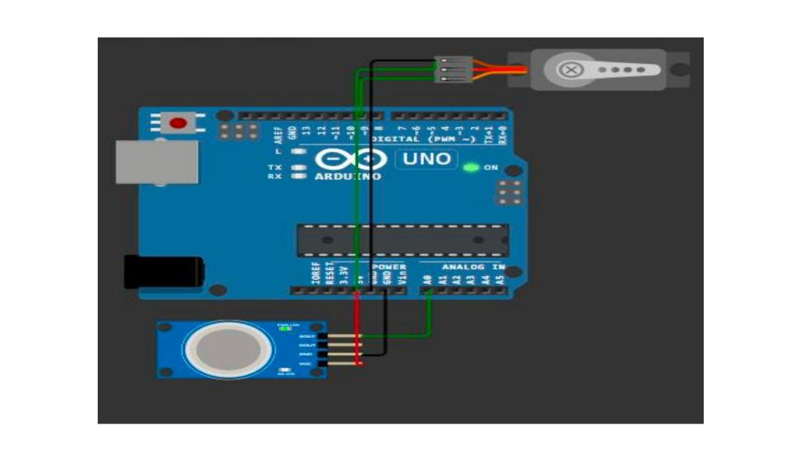

# ⚠️ Gas Leakage Detection & Automatic Protection System

<div align="center">

```
  ╔══════════════════════════════════════════════════════╗
  ║  GAS MONITOR v1.0          [ ARDUINO UNO + MQ-135 ] ║
  ║  ─────────────────────────────────────────────────  ║
  ║  Gas Level  : 052        Threshold : 130            ║
  ║  Valve      : OPEN       LED       : 🟢 GREEN       ║
  ║  Buzzer     : OFF        Status    : ✅  SAFE        ║
  ╚══════════════════════════════════════════════════════╝
```


**Core skills:** `Analog Gas Sensing` · `Adaptive Threshold Calibration` · `Multi-Output Alerting` · `Servo Actuation` · `Fail-Safe Design`

</div>

---

## ☠️ Why This Exists

Gas leaks don't knock before entering. LPG and methane are colourless, nearly odourless at low concentrations, and completely undetectable by humans until the level is already dangerous. Most accidents happen while people are asleep or simply not paying attention — by the time someone notices, it's too late to react calmly.

This project removes the human from the detection loop entirely. The moment gas crosses a safe level, the system reacts — valve closes, buzzer sounds, red LED fires — all automatically, in under 500ms, without anyone needing to be present.

---

## 📌 Project Overview

A self-built safety prototype using an Arduino UNO, MQ-135 gas sensor, servo motor (simulating a valve), active buzzer, and red/green LEDs. The system calibrates its own safe baseline on startup, then continuously monitors air quality and triggers a full alert — visual, audible, and mechanical — the moment gas is detected.

**Total build cost: ₹689.**

---

## 🧠 System Logic

```
  STARTUP
    │
    ├─▶ Warm up MQ-135 (2 min)
    └─▶ Sample 20 readings → set threshold = avg + 50

  LOOP (every 500ms)
    │
    ├─▶ Read gas level from MQ-135
    │
    ├── gasLevel > threshold? ──YES──▶  🔴 Red LED ON
    │                                   🔔 Buzzer ON
    │                                   🔧 Servo → 90° (valve closed)
    │                                   📋 Log "DANGER"
    │
    └── NO ──▶  🟢 Green LED ON
                🔇 Buzzer OFF
                🔧 Servo → 0° (valve open)
                📋 Log "SAFE"
```

---

## 🧰 Bill of Materials

| # | Component | Qty | Cost (INR) |
|---|-----------|:---:|:----------:|
| 1 | Arduino UNO R3 | 1 | ₹249 |
| 2 | MQ-135 Gas Sensor Module | 1 | ₹130 |
| 3 | SG90 Servo Motor | 1 | ₹135 |
| 4 | Active Buzzer | 1 | ₹25 |
| 5 | Red LED + 220Ω Resistor | 1 | ₹5 |
| 6 | Green LED + 220Ω Resistor | 1 | ₹5 |
| 7 | Mini Breadboard | 1 | ₹65 |
| 8 | Jumper Wires (set) | 1 | ₹75 |
| | | **Total** | **~₹689** |

> 🛒 Prices from [Robu.in](https://robu.in), early 2026.

---

## 🔌 Wiring Reference

### Connection Diagram



| Component | Arduino Pin | Notes |
|-----------|:-----------:|-------|
| MQ-135 Analog Out | A0 | Gas concentration (0–1023) |
| MQ-135 VCC | 5V | Sensor heater draws ~150mA |
| MQ-135 GND | GND | — |
| Servo Signal | D9 (PWM) | 0° = open, 90° = closed |
| Buzzer (+) | D7 | Active buzzer, no resistor needed |
| Red LED | D6 | Via 220Ω resistor to GND |
| Green LED | D5 | Via 220Ω resistor to GND |
| All GND | GND | Common ground |

---

## 💻 Source Code

The standout feature is adaptive threshold calibration on startup — no hardcoded values, works in any environment:

```cpp
// Calibrate on startup — no hardcoding needed
int calibrate() {
  Serial.println("Calibrating... keep area clear.");
  long sum = 0;
  for (int i = 0; i < 20; i++) {
    sum += analogRead(GAS_SENSOR_PIN);
    delay(500);
  }
  int baseline = sum / 20;
  return baseline + 50;  // threshold = baseline + safety margin
}

// Alert logic
if (gasLevel > threshold) {
  digitalWrite(RED_LED, HIGH);
  digitalWrite(GREEN_LED, LOW);
  digitalWrite(BUZZER, HIGH);
  gateServo.write(90);          // prototype valve → closed
  Serial.println("DANGER: Gas detected!");
} else {
  digitalWrite(GREEN_LED, HIGH);
  digitalWrite(RED_LED, LOW);
  digitalWrite(BUZZER, LOW);
  gateServo.write(0);           // prototype valve → open
  Serial.println("SAFE");
}
```

> 📁 Full source: [`src/gas_leakage_detector.ino`](src/gas_leakage_detector.ino)

> 💡 MQ-135 needs ~2 minutes of warm-up before readings stabilise. The calibration loop accounts for this — let it finish before testing.

---

## 📊 Observed Behaviour

| Condition | Sensor Reading | LED | Buzzer | Servo |
|-----------|:--------------:|-----|--------|-------|
| Clean ambient air | ~50–80 | 🟢 Green | OFF | 0° open |
| Mild gas nearby | ~90–120 | 🟢 Green | OFF | 0° open |
| Leakage detected | >130 | 🔴 Red | **ON** | **90° closed** |
| Gas cleared | Returns to baseline | 🟢 Green | OFF | 0° open |

---

## ✅ Strengths

- **Adaptive calibration** — measures its own environment on startup, no manual tuning needed
- **Three simultaneous outputs** — LED + buzzer + servo all fire at once, no single point of notification failure
- **Self-resetting** — automatically recovers when gas clears, no manual reset required
- **Serial logging** — every reading captured, useful for diagnosing when and why alarms triggered

---

## ⚠️ Limitations

- **MQ-135 is non-specific** — detects ammonia, smoke, and CO₂ too; cooking fumes can cause false alarms
- **Servo is prototype-only** — SG90 cannot handle real pipeline pressure; a solenoid valve + relay would be needed for real deployment
- **No persistent log** — history is lost on power cycle; EEPROM or SD card would fix this
- **Single sensor** — one unit has a blind spot; two sensors at different heights improve coverage

---

## 🚀 Roadmap

- [ ] **3-reading confirmation** — require 3 consecutive readings above threshold before triggering, eliminating single-spike false alarms
- [ ] **Solenoid valve + relay** — replace the servo with a real 12V solenoid valve via relay module for actual gas pipe control
- [ ] **GSM alert** — SIM800L module to send an SMS when gas is detected
- [ ] **EEPROM logging** — store last 10 alarm events in non-volatile memory, survives power cycles

---

## 🧠 What I Learned

The first version of this project hardcoded `threshold = 130`. It worked fine on my desk. I moved it to another room and it false-triggered every 30 seconds because the ambient air quality was slightly different there. That failure taught me something important: **a safety system that cries wolf is almost as bad as one that doesn't work** — people start ignoring alarms, which defeats the entire purpose.

The adaptive calibration was the fix, but it required a different way of thinking. Instead of assuming what "safe" looks like, the system measures it. Every deployment gets its own baseline. That's a small change in code but a significant change in how you think about building reliable systems.

The other lesson came from the servo. Watching it snap to 90° the moment gas was detected felt like the project clicking into place — that physical response made the whole thing real in a way that a serial print never does. But it also made the limitation obvious: this is a toy valve. Real safety requires real hardware. Understanding that gap — between what a prototype demonstrates and what production requires — is something I'll carry into every hardware project going forward.

**What I'd do differently:**
- Add the 3-reading confirmation from the start — single spike false alarms are annoying and erode trust in the system
- Log to EEPROM — a safety device with no memory of past events is missing half its value
- Test in multiple environments before calling it done — the hardcoded threshold failure was an avoidable mistake

---

## 🗂️ Repository Structure

```
📦 gas-leakage-detector
 ┣ 📁 src/
 ┃ ┗ 📄 gas_leakage_detector.ino
 ┣ 📁 docs/
 ┃ ┗ 📄 report.pdf
 ┗ 📄 README.md
```

---

## 📄 License

MIT — use it, build on it, stay safe. Drop a ⭐ if it helped.

---

<div align="center">

```
  gas leaks  ──▶  MQ-135 detects  ──▶  Arduino decides  ──▶  system reacts
                                          [ < 500ms ]
              no human required. that's the whole point.
```

</div>
